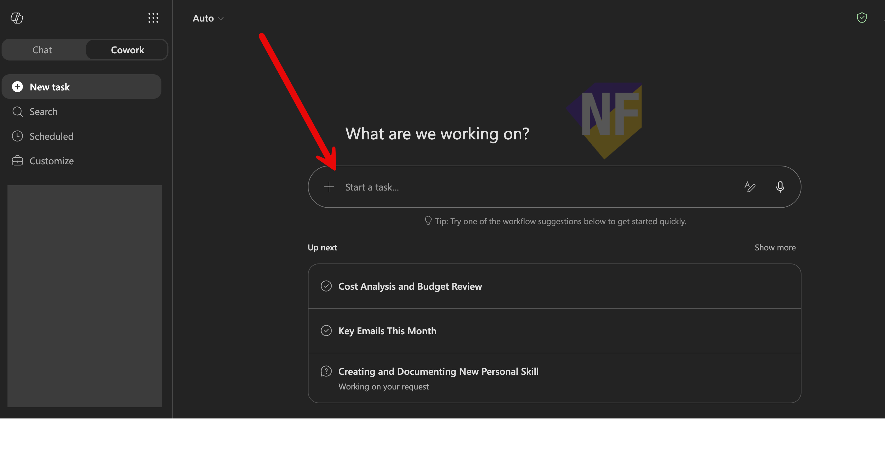

# Session 2 Setup: Copilot Cowork — Checklist สำหรับผู้ใช้งานทั่วไป

ใช้ Checklist นี้เพื่อเตรียมความพร้อมก่อนวันจัดงาน

## เป้าหมายของ Session

ผู้เข้ารับการอบรมจะได้ตรวจสอบความพร้อมของระบบและสิทธิ์การใช้งาน Microsoft 365 Copilot Cowork ก่อนเข้าร่วมการอบรม

## สิ่งที่ต้องเตรียม

### 1. License และสิทธิ์เข้าถึง

- [ ] บัญชีผู้ใช้ Microsoft 365มี Microsoft 365 Copilot license ที่ใช้งานได้
- [ ] บัญชีอยู่ใน Frontier preview สำหรับ Cowork (ถ้าไม่แน่ใจ ให้ติดต่อผู้ดูแลระบบ IT ขององค์กรเพื่อยืนยัน)
- [ ] เข้าถึง https://m365copilot.com ได้

### 2. ความพร้อมของระบบ

- [ ] Sign in เข้าเว็บ https://m365copilot.com/ ด้วยบัญชี Microsoft ขององค์กรได้
- [ ] เปิด Copilot Chat ได้สำเร็จ
- [ ] มี Cowork จากเมนูด้านซ้ายให้ใช้งาน (แสดงว่า license ถูกเปิดใช้งานแล้ว)

> ⚠️ หมายเหตุ: หากไม่พบ Cowork ในเมนูด้านซ้าย ให้ติดต่อผู้ดูแลระบบ IT ขององค์กรเพื่อยืนยันว่า license ถูกเปิดใช้งานแล้ว

### 3. ตรวจสอบว่า Cowork พร้อมใช้งาน

- ทดสอบพิมพ์ข้อความใน Cowork Chat และตรวจสอบว่าได้รับการตอบกลับจาก Copilot
  
## ลิงก์อ้างอิง

- ภาพรวมของ Cowork: https://learn.microsoft.com/microsoft-365/copilot/cowork/
- เริ่มต้นใช้งาน Cowork: https://learn.microsoft.com/microsoft-365/copilot/cowork/get-started
- การใช้งาน Cowork controls และ Approvals: https://learn.microsoft.com/microsoft-365/copilot/cowork/use-cowork
