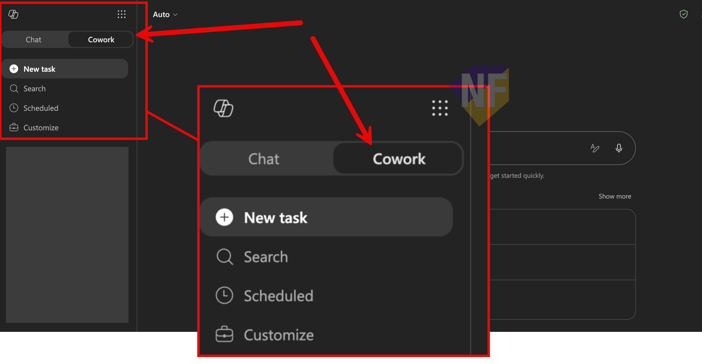

# Session 2 Setup: Copilot Cowork — Service Recovery Checklist

ใช้ Checklist นี้เพื่อเตรียมความพร้อมก่อนวันจัดงาน

## เป้าหมายของ Session

ผู้เข้ารับการอบรมจะได้ตรวจสอบความพร้อมของระบบและสิทธิ์การใช้งาน Microsoft 365 Copilot Cowork ก่อนเข้าร่วม Service Recovery workshop

## สิ่งที่ต้องเตรียม

### 1. License และสิทธิ์เข้าถึง

- [ ] บัญชีผู้ใช้ Microsoft 365มี Microsoft 365 Copilot license ที่ใช้งานได้
- [ ] ผู้ดูแลยืนยันว่า Cowork และ usage-based billing พร้อมสำหรับบัญชีทดสอบ
- [ ] ผู้ดูแลยืนยันว่า tenant เปิดใช้โมเดลที่ Cowork ต้องใช้ตามนโยบายขององค์กร
- [ ] เข้าถึง https://m365copilot.com ได้

### 2. ความพร้อมของระบบ

- [ ] Sign in เข้าเว็บ https://m365copilot.com/ ด้วยบัญชี Microsoft ขององค์กรได้
- [ ] เปิด Copilot Chat ได้สำเร็จ
- [ ] มี Cowork จากเมนูด้านซ้ายให้ใช้งาน (แสดงว่า license ถูกเปิดใช้งานแล้ว)

> ⚠️ หมายเหตุ: หากไม่พบ Cowork ในเมนูด้านซ้าย ให้ติดต่อผู้ดูแลระบบ IT ขององค์กรเพื่อยืนยันว่า license ถูกเปิดใช้งานแล้ว

### 3. ตรวจสอบว่า Cowork พร้อมใช้งาน

- ทดสอบพิมพ์ข้อความใน Cowork Chat และตรวจสอบว่าได้รับการตอบกลับจาก Copilot
  

### 4. ไฟล์และ safety boundary

- [ ] ดาวน์โหลด [service recovery sample pack](./files/service-recovery-files.zip) ได้
- [ ] อัปโหลดไฟล์ตัวอย่างไปยัง OneDrive ของบัญชีทดสอบได้
- [ ] เตรียมบัญชีทดสอบที่ไม่มีข้อมูลจริง และห้ามส่ง email/Teams invitation ออกนอก workshop
- [ ] ตรวจว่า Calendar และ Scheduled ใช้ได้หรือทราบวิธีข้าม Exercise 05–06 หาก tenant ปิดความสามารถ
## ลิงก์อ้างอิง

- ภาพรวมของ Cowork: https://learn.microsoft.com/microsoft-365/copilot/cowork/
- เริ่มต้นใช้งาน Cowork: https://learn.microsoft.com/microsoft-365/copilot/cowork/get-started
- การใช้งาน Cowork controls และ Approvals: https://learn.microsoft.com/microsoft-365/copilot/cowork/use-cowork

> Validation date: 25 June 2026
