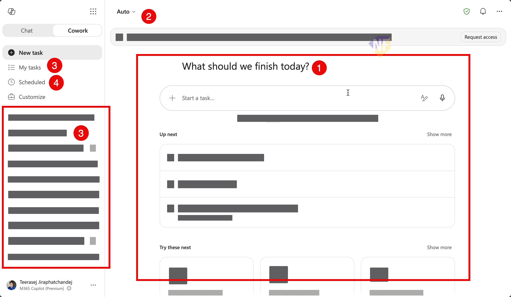
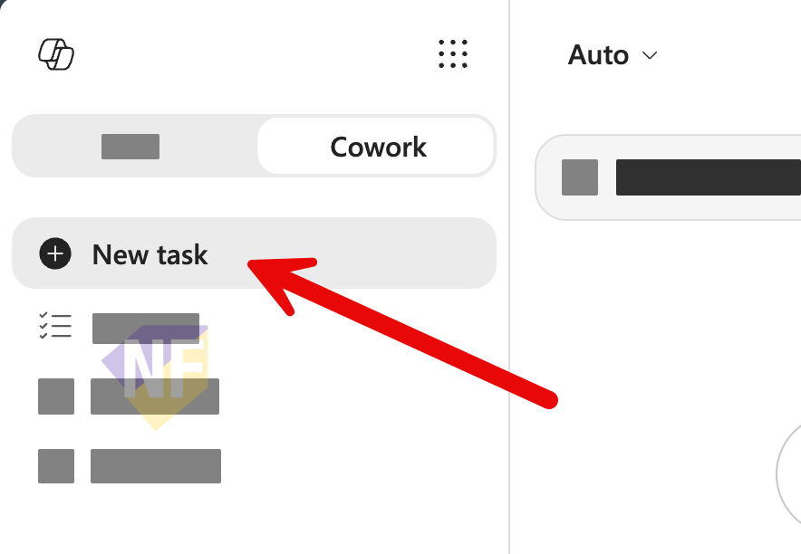
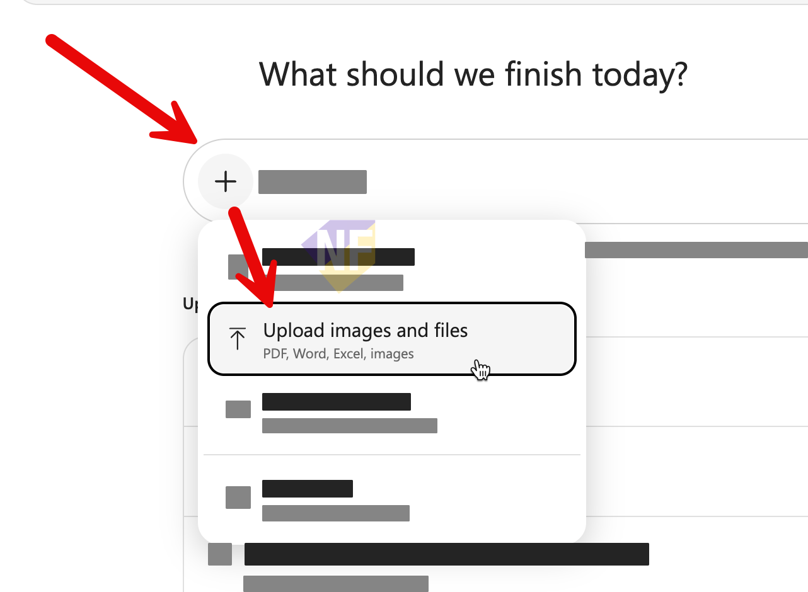
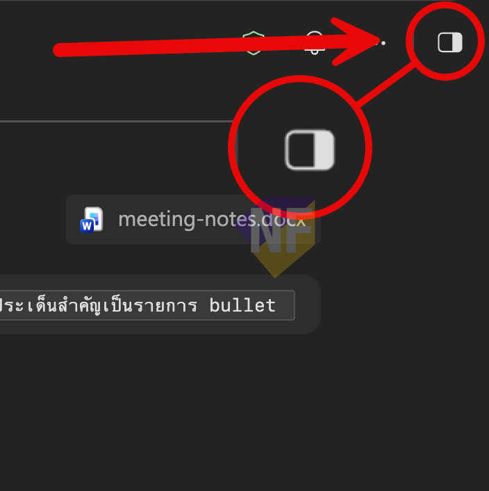
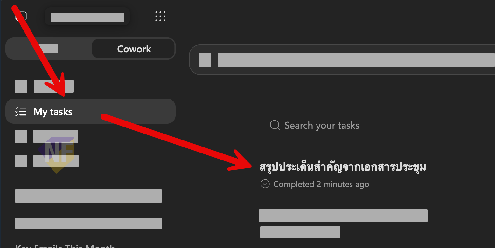

# Exercise 01: เปิด Cowork และสร้าง Word Output ใน OneDrive

🔑 ต้องมี Microsoft 365 Copilot license และผู้ดูแลเปิดใช้ Cowork แล้ว

ในแบบฝึกหัดแรกนี้ เราจะ Sign in ด้วยบัญชีที่ Event จัดเตรียมไว้, เปิด **Cowork** จาก Microsoft 365 Copilot, แนบ work context และเปลี่ยนคำตอบล่าสุดของ Cowork เป็นไฟล์ Word ที่เปิดจาก OneDrive ได้

---

## ไฟล์ที่ต้องดาวน์โหลดก่อนเริ่ม

กดลิงก์ด้านล่างเพื่อดาวน์โหลดไฟล์ตัวอย่างสำหรับ Session นี้ แล้วอัปโหลดขึ้น **OneDrive** ของบัญชีทดสอบในโฟลเดอร์ที่หาเจอง่าย เช่น `Cowork workshop` ก่อนเริ่ม Exercise 01

หรือดาวน์โหลดทั้งหมดในคราวเดียว:

- 📦 **[service-recovery-files.zip — ดาวน์โหลดทุกไฟล์ในครั้งเดียว](https://github.com/teerasej/multi-agent-try-out/raw/main/copilot-cowork/new-copilot-cowork/files/service-recovery-files.zip)**

หรือดาวน์โหลดทีละไฟล์:

- 📄 [service-incident-timeline.docx — Service incident timeline](https://github.com/teerasej/multi-agent-try-out/raw/main/copilot-cowork/new-copilot-cowork/files/service-incident-timeline.docx)
- 📊 [service-performance-dashboard.xlsx — Service performance dashboard](https://github.com/teerasej/multi-agent-try-out/raw/main/copilot-cowork/new-copilot-cowork/files/service-performance-dashboard.xlsx)
- 📑 [executive-service-context.pptx — Executive service context](https://github.com/teerasej/multi-agent-try-out/raw/main/copilot-cowork/new-copilot-cowork/files/executive-service-context.pptx)

> **💡 เคล็ดลับ:** Cowork รับไฟล์จากเครื่องได้ แต่การเก็บไฟล์ตัวอย่างไว้ใน OneDrive ทำให้เลือกเป็น work context, เปิด preview และใช้ต่อใน task ได้สะดวกกว่า

---

## Feature 1: Sign In และเปิด Cowork

1. เปิด Microsoft Edge หรือ Google Chrome แล้วไปที่ **[https://m365.cloud.microsoft](https://m365.cloud.microsoft)**

2. กด **Sign in** แล้วใช้บัญชีที่ Event จัดเตรียมให้ (รับจากผู้ดูแล) เพื่อเข้าสู่ระบบ

3. ที่ด้านบนของหน้าจอ เลือก tab **Cowork** ที่อยู่ข้าง **Chat**

4. ถ้าไม่เห็น tab Cowork ให้แจ้งผู้จัดงานทันที ไม่ต้องค้นหาใน **Agents** หรือ **Agent Store** เพราะ Cowork เป็น tab หลักของ Microsoft 365 Copilot แล้ว

## Feature 2: รู้จักหน้า Cowork

เมื่อหน้า Cowork เปิดขึ้น ให้ใช้เวลา 2–3 นาทีสังเกตส่วนต่อไปนี้:



1. ช่องพิมพ์งานและ Suggested prompts เช่น Catch me up หรือ Prep for a meeting
2. ตัวเลือก model ที่มุมบนซ้าย — ใช้ **Auto** ตลอด workshop นี้
3. My Task: แสดงงานล่าสุดและ task ที่คุณสร้างไว้เพื่อกับไปทำต่อได้
4. Scheduled สำหรับงานที่ตั้งเวลา และ Customize สำหรับ Plugins/Skills (อาจไม่แสดงในทุก tenant)

> **⚠️ หมายเหตุ:** อย่าเปลี่ยน model, เพิ่ม Plugin หรือเปิด Browser use ใน workshop นี้ เว้นแต่ Facilitator ประกาศให้ทำ

## Feature 3: เพิ่ม Work Context และดู Side panel

1. กดปุ่ม **+ New Task** จากเมนู Cowork ด้านซ้ายบน เพื่อสร้าง task สั้น ๆ จากช่องพิมพ์ prompt บนหน้า Cowork
   
2. กดปุ่ม **Add attachments** แล้วเลือกไฟล์ `service-incident-timeline.docx` จาก OneDrive ที่เตรียมไว้ (หรืออัปโหลดจากเครื่องก็ได้) เพื่อให้ Cowork ใช้เป็น work context
   
   จะมีตตัวเลือกดังนี้
   - เลือก **Add work context** เมื่อจะอ้างอิงไฟล์, บุคคล, อีเมล, Teams chat/channel หรือ meeting ในองค์กร
   - เลือก **Attach cloud files** เมื่อต้องการเลือกจาก OneDrive, SharePoint หรือ Teams
   - เลือก **Upload images and files** เมื่อต้องการแนบจากเครื่องโดยตรง

3. คัดลอก Prompt ด้านล่างมาใช้:

   ```
   จากไฟล์ service-incident-timeline.docx ที่แนบมา
   สรุปสถานการณ์เป็นภาษาไทยภายใต้ 4 หัวข้อ:
   1) Current situation and service status
   2) Customer and business impact
   3) Immediate priorities
   4) Facts, working hypotheses and unknowns

   ใช้เฉพาะข้อมูลจากไฟล์ต้นทาง และห้ามสร้างข้อเท็จจริงเพิ่ม
   ```

4. ระหว่าง Cowork ทำงาน ให้เปิด Side panel ด้านขวาและสังเกต:
   
   - **Reference** สำหรับไฟล์ที่แนบมา
   - **Progress** และขั้นตอนการทำงาน
   - **Input** สำหรับไฟล์ต้นทาง และ **Output** สำหรับไฟล์ที่ Cowork สร้าง
   - **Skills** ที่ Cowork โหลดมาใช้
   - **Permissions** และ **Schedule** ถ้ามี

5. เมื่อได้ผลลัพธ์แล้ว ให้เปิด task นี้จาก Tasks/Search อีกครั้ง เพื่อยืนยันว่าคุณสามารถกลับมาทำงานต่อจาก task เดิมได้
   

---

## Feature 4: เปลี่ยนคำตอบล่าสุดเป็นไฟล์ Word และเปิดใน OneDrive

1. ใน **task เดิม** ส่ง Prompt นี้:

   ```
   ใช้คำตอบล่าสุดของคุณใน conversation นี้
   สร้างไฟล์ Word ชื่อ Executive Situation Summary

   ใช้หัวข้อเดิมทั้ง 4 หัวข้อ และคงเฉพาะข้อเท็จจริงจากคำตอบล่าสุด
   ห้ามเพิ่มข้อมูลใหม่ ห้ามส่ง แชร์ โพสต์ หรือนัดหมาย
   ```

2. รอให้ Cowork สร้างไฟล์ แล้วเปิด Side panel > **Output**

3. เปิด preview ของ `Executive Situation Summary` และตรวจว่า:

   - [ ] เป็นไฟล์ Word
   - [ ] มี 4 หัวข้อตามคำตอบล่าสุด
   - [ ] Root cause ยังไม่ถูกระบุว่าเป็นข้อเท็จจริง

4. เลือก **Open in OneDrive** จาก preview หรือ Output เพื่อยืนยันว่าไฟล์ถูกสร้างและเก็บไว้ใน OneDrive ของบัญชีทดสอบแล้ว

5. กลับมาที่ Cowork task เดิมและเก็บไฟล์นี้ไว้ใน Output เพื่อใช้ต่อใน Exercise 02
---

## สรุป

คุณได้เปิด Cowork จาก tab ที่ถูกต้อง, เตรียม work context, รู้จัก Side panel และสร้างไฟล์ Word ที่เปิดใน OneDrive ได้แล้ว **ให้เก็บ task นี้ไว้** เพราะ Exercise 02–03 จะทำต่อจาก Output เดิม

---

แบบฝึกหัดถัดไป: [Exercise 02: สร้าง Recovery Action Register ด้วย Cowork](../02-create-recovery-action-register/README.md)
