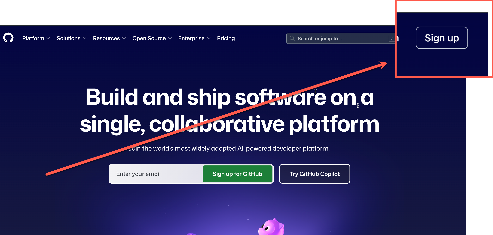
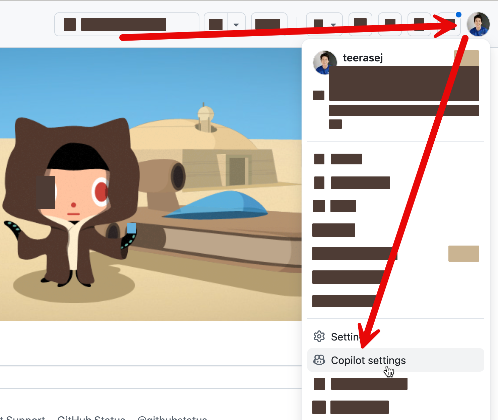
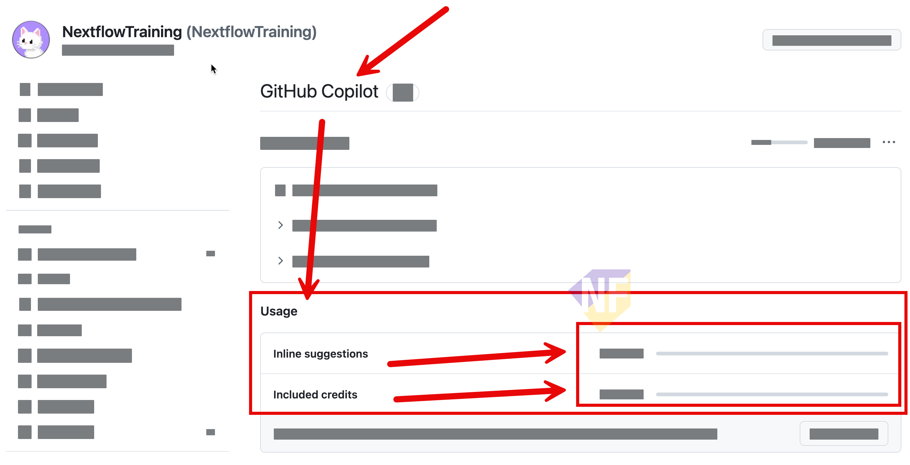

# Session 1 Setup: GitHub Copilot Agent — Checklist สำหรับนักพัฒนา

ใช้ Checklist นี้เพื่อเตรียมความพร้อม สมัครบัญชี GitHub และเช็คความพร้อมก่อนเข้า session วันอบรมนะครับ

> **⚠️ Note 1:** ควรใช้ github account แบบที่เป็น Personal Account (ไม่ใช่ Organization Account) และยืนยัน Email แล้ว เพื่อหลีกเลี่ยงการติดปัญหาเรื่องสิทธิ์การใช้งานความสามารถของ GitHub Copilot บางอย่างครับ

> **⚠️ Note 2:** หากใช้ บัญชี GitHub แบบ Organization Account ให้เช็คกับผู้ดูแลระบบขององค์กรว่ามีสิทธิ์ใช้งาน GitHub Copilot และ Github Codespaces หรือไม่นะครับ

## เป้าหมายของ Session

ใน Session นี้ ผู้เข้าร่วมจะใช้ GitHub Copilot Agent Mode เพื่อเพิ่มฟีเจอร์ให้กับ Web App จริง และรันแอปผ่าน Codespaces

## สิ่งที่ต้องเตรียม

### 1. บัญชี GitHub

- [ ] มีบัญชี GitHub ส่วนตัว (Personal Account) และยืนยัน Email แล้ว
- [ ] Sign in เข้า github.com ได้
- [ ] มีสิทธิ์ใช้งาน GitHub Copilot (Free, Pro, Business หรือ Enterprise) 

### 2. เบราว์เซอร์และการเชื่อมต่อ

- [ ] ติดตั้ง Microsoft Edge หรือ Google Chrome เวอร์ชันล่าสุดแล้ว
- [ ] เข้าใช้งาน github.com และ codespaces.github.com ได้
- [ ] Firewall หรือ Proxy ขององค์กรไม่ได้บล็อก GitHub Codespaces

### 3. เปิดใช้งาน GitHub Copilot สำหรับ Free Account

- เช็คว่าบัญชีของพวกเรามีสิทธิ์ใช้งาน GitHub Copilot หรือไม่ โดยไปที่ https://github.com/settings/copilot/features

### 4. ทดสอบด้วยตัวเอง (3 นาที)

1. Sign in เข้า [GitHub.com](https://github.com) ด้วยบัญชีของพวกเรา
2. เปิด Repository ใดก็ได้ในเบราว์เซอร์
3. กดเปิดเมนูของ Github Profile จากด้านบนขวา > ลงมาเลือกเมนูของ GitHub Copilot 
   
4. เช็คว่ามีปริมาณ Credit เพียงพอประมาณ 75%+ เผื่อสำหรับทำ workshop
   
## ลิงก์อ้างอิง

- สมัครบัญชี GitHub: https://github.com
- เอกสาร GitHub Copilot: https://docs.github.com/copilot
- Microsoft Learn (แนวคิด Agent Mode): https://learn.microsoft.com/visualstudio/ide/copilot-agent-mode
