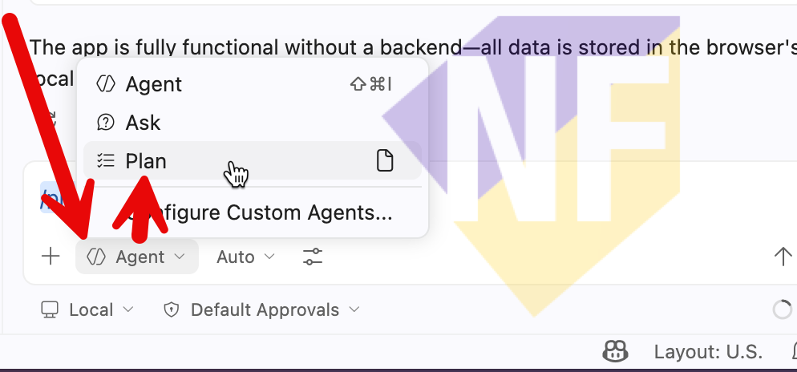
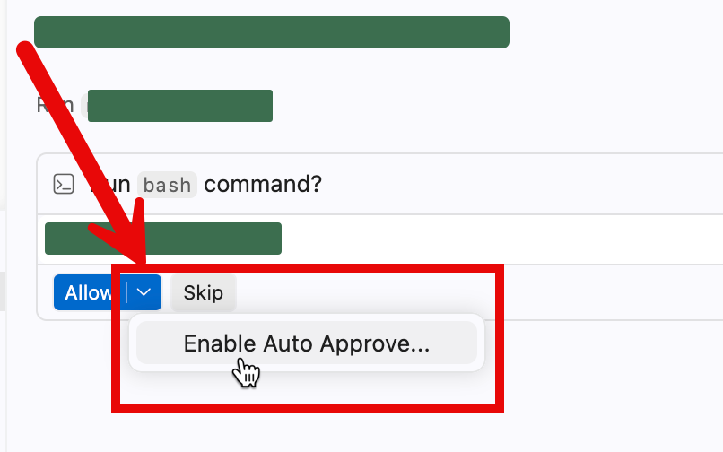

# Exercise 03: วางแผนฟีเจอร์ด้วย Plan Mode

🔑 ใช้ได้ทั้ง GitHub Copilot Free และ Pro

**Plan Mode** คือโหมดที่ Copilot จะ *วางแผน* ก่อนลงมือแก้ไขโค้ด — เหมาะมากสำหรับการทำความเข้าใจขอบเขตของงานก่อนให้ AI ลงมือทำจริง

ในที่นี้เราจะให้ Copilot วางแผนการเพิ่มฟีเจอร์ **"Character Count"** ที่จะแสดงจำนวนตัวอักษรที่ผู้ใช้พิมพ์ในช่อง Note แบบเรียลไทม์


---

## Practice 1: เปิด Plan Mode

1. ใน Copilot Chat panel กดที่ Dropdown ชื่อ Mode ด้านล่างของช่อง Chat (ปัจจุบันอาจแสดงว่า **Ask** หรือ **Agent**)

2. เลือก **Plan**

   

---

## Practice 2: ให้ Copilot วางแผนเพิ่มฟีเจอร์

1. ในช่อง Chat พิมพ์หรือวาง Prompt ด้านล่าง แล้วกด Enter:

   ```
   Add a character count that shows below the note content text area, updating in real-time as the user types.
   ```

2. รอ Copilot อ่านโค้ดและสร้าง Plan — พวกเราจะเห็น:
   - **สรุปงานโดยรวม** (High-level summary)
   - **ขั้นตอนย่อย** (Step-by-step breakdown)
   - **คำถามสำหรับข้อมูลที่ยังไม่ชัดเจน** (ถ้ามี)

3. อ่าน Plan ที่ Copilot สร้างให้ และตรวจสอบว่าเข้าใจสิ่งที่ Copilot จะทำ

---

## Practice 3: เริ่ม Implementation

1. กดปุ่ม **Start Implementation** ที่ปรากฏด้านล่าง Plan

2. Copilot จะเปลี่ยนเป็น Agent Mode และเริ่มแก้ไขไฟล์ให้อัตโนมัติ แต่ถ้ามีการใช้ tools ต่างๆ จะมีขั้นตอนให้กด Confirm เป็นระยะๆ เพื่อให้พวกเราควบคุมการทำงานได้
3. ในที่นี้เราจะเปิดโหมด Auto Approve ให้คลิกที่ด้านข้างของปุ่ม **Allow** และเลือก **Enable Auto Approve** และกดยืนยัน

   

4. ดูการเปลี่ยนแปลงที่เกิดขึ้นในไฟล์ต่าง ๆ — Copilot จะ Highlight บรรทัดที่เพิ่มหรือแก้ไข

5. เมื่อเสร็จแล้ว ลองกลับไปดู Preview ของแอป — กรอกข้อความในช่อง Note และสังเกตว่ามีตัวเลขนับตัวอักษรแสดงขึ้นมา

> **💡 เคล็ดลับ:** ถ้า Copilot ถามว่า "Do you want to continue?" หรือขอ Confirm ให้กด **Continue** เพื่อดำเนินการต่อ

---

## สรุป

พวกเราได้ใช้ Plan Mode เพื่อวางแผนและ Start Implementation ได้สำเร็จแล้ว สังเกตว่า Plan Mode ช่วยให้เรา "เห็นภาพ" ก่อนว่า AI จะทำอะไรบ้าง ก่อนที่มันจะเริ่มแก้โค้ดจริง ๆ ในแบบฝึกหัดถัดไป เราจะใช้ **Agent Mode** โดยตรงกัน

---

แบบฝึกหัดถัดไป: [Exercise 04: พัฒนาฟีเจอร์อัตโนมัติด้วย Agent Mode](../04-agent-mode/README.md)
