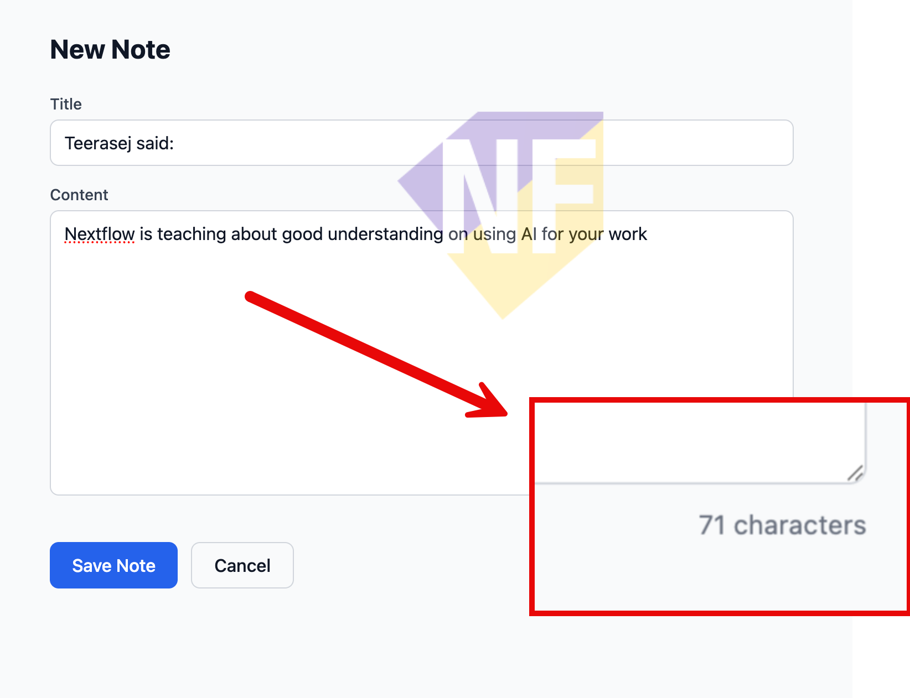

# Exercise 04: พัฒนาฟีเจอร์อัตโนมัติด้วย Agent Mode

🔑 ใช้ได้ทั้ง GitHub Copilot Free และ Pro

**Agent Mode** คือโหมดที่ทรงพลังที่สุดของ Copilot — AI จะวางแผน แก้ไขไฟล์ รันคำสั่ง และแก้ Error ซ้ำ ๆ จนงานเสร็จโดยอัตโนมัติ ในแบบฝึกหัดนี้เราจะให้ Copilot เพิ่มฟีเจอร์ **"Pin Note"** ให้แอปของเรา

---

## Feature 1: เปิด Agent Mode

1. ใน Copilot Chat panel กดที่ Dropdown ชื่อ Mode ด้านล่างของช่อง Chat
2. ให้แน่ใจว่าได้เลือก **Agent**


---

## Feature 2: ให้ Copilot เพิ่มฟีเจอร์ Pin Note

1. ในช่อง Chat พิมพ์หรือวาง Prompt ด้านล่าง แล้วกด Enter:

   ```
   Add a "pin note" feature. Each note card should have a pin icon button. Pinned notes should appear at the top of the notes list. 
   ```

2. ด้านล่างของช่อง Prompt ใน Copilot Chat จะมีปุ่ม Set Permission ที่แสดงว่า **Default Approval** อยู่ ให้คลิกเลือกเปลี่ยนเป็น **Bypass Approvals** เพื่อให้ Copilot สามารถใช้ tools ต่างๆ ได้อย่างอิสระโดยไม่ต้องขออนุญาตเป็นระยะๆ

   

3. สังเกตการทำงานของ Copilot:
   - Copilot จะเริ่มอ่านไฟล์ที่เกี่ยวข้อง
   - แก้ไขหลายไฟล์พร้อมกัน เช่น `lib/notes.ts`, `components/NoteCard.tsx`, `app/page.tsx`
   - อาจรันคำสั่ง Terminal เพื่อตรวจสอบ

4. ถ้า Copilot ขอ Confirm ก่อนรันคำสั่ง ให้กด **Allow** เพื่อให้ดำเนินการต่อ

5. เมื่อเสร็จแล้ว กลับไปดู Preview ของแอปในเบราว์เซอร์ และลอง:
   - กด Pin icon บนการ์ด Note
   - สังเกตว่า Note ที่ Pin แล้วจะขึ้นมาอยู่ด้านบนของ List

> **⚠️ หมายเหตุ:** ถ้า Copilot แก้ไขไฟล์ผิดพลาดหรือมี Error ให้รอ — Copilot จะพยายามแก้ Error เองก่อน

> **💡 เคล็ดลับ:** ลองกดที่ชื่อไฟล์ในคำตอบของ Copilot เพื่อกระโดดไปดูโค้ดที่มันแก้ไขได้เลย

---

## สรุป

คุณได้ใช้ Agent Mode ให้ Copilot เพิ่มฟีเจอร์ใหม่แบบ Autonomous ได้สำเร็จ ขั้นถัดไปเราจะเริ่มปรับแต่งวิธีทำงานของ Copilot เอง โดยเริ่มจาก `Custom Prompt` สำหรับงานที่ต้องทำซ้ำบ่อย

---

แบบฝึกหัดถัดไป: [Exercise 05: สร้าง Custom Prompt สำหรับงานที่ทำซ้ำบ่อย](../05-custom-prompt/README.md)
