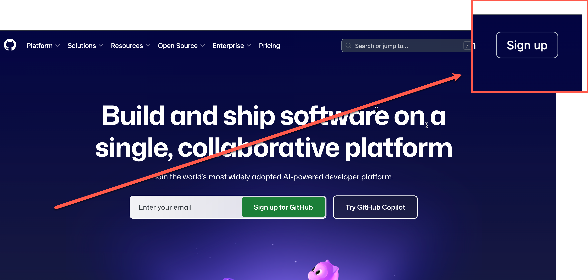

# Session 1 Setup: GitHub Copilot Agent - Checklist (Developer Audience)

Use this checklist before event day.

## Session Outcome

In this session, participants use GitHub Copilot Agent Mode to extend a real web app in Codespaces, review changes, and run the app.

## What To Prepare

### 1. Account Readiness

- [ ] Personal GitHub account is created and email is verified.
- [ ] GitHub account can sign in to github.com.
- [ ] GitHub Copilot access is available (Free, Pro, Business, or Enterprise).

### 2. Browser and Network Readiness

- [ ] Latest Microsoft Edge or Google Chrome is installed.
- [ ] Network can access github.com, and codespaces.github.com.
- [ ] Corporate firewall or proxy does not block GitHub Codespaces.

### 3. Github Copilot Activation for free accounts

### 5. Quick Self-Test (3 Minutes)

1. Sign in to GitHub.
2. Open any repository in browser.

## Useful References

- GitHub account setup: https://github.com
- GitHub Copilot docs: https://docs.github.com/copilot
- Microsoft Learn (agent mode concept): https://learn.microsoft.com/visualstudio/ide/copilot-agent-mode
