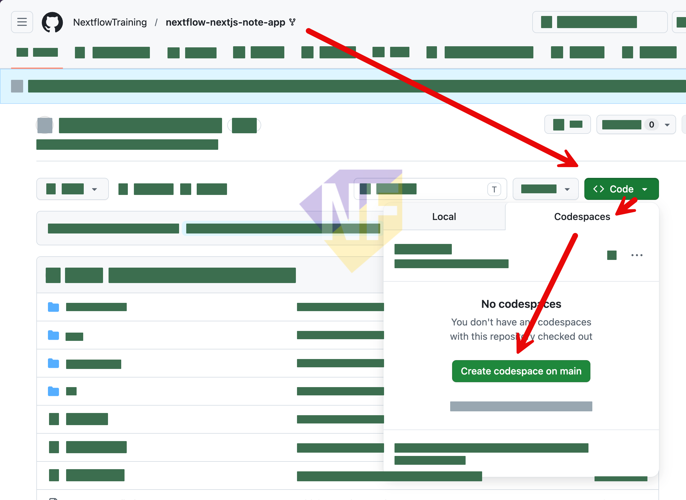

# Exercise 01: Fork Repo และเริ่ม Codespaces

🄓 ใช้ได้ทั้ง GitHub Copilot Free และ Pro

ในแบบฝึกหัดนี้ เราจะเปิด Sample Project ที่เตรียมไว้, Fork เข้าบัญชีของตัวเอง แล้วเปิดใช้งาน **GitHub Codespaces** เพื่อเริ่มเขียนโค้ดในเบราว์เซอร์ได้ทันที โดยไม่ต้องติดตั้งอะไรบนเครื่อง

---

## Feature 1: Fork Repository

1. เปิด URL ของ Sample Project ด้านล่างในเบราว์เซอร์:

   👉 **[https://github.com/teerasej/nextflow-nextjs-note-app](https://github.com/teerasej/nextflow-nextjs-note-app)**

2. มุมบนขวาของหน้า กดปุ่ม **Fork**

   

3. หน้าจอ "Create a new fork" จะปรากฏ — ตรวจสอบว่า **Owner** เป็นบัญชีของคุณ แล้วกด **Create fork**

4. รอสักครู่ — GitHub จะพาคุณเข้าไปยัง Repo ที่ Fork แล้วในบัญชีของคุณ

> **💡 เคล็ดลับ:** Fork คือการคัดลอก Repo มาไว้ในบัญชีของตัวเอง คุณจึงสามารถแก้ไขโค้ดได้อย่างอิสระโดยไม่กระทบ Repo ต้นฉบับ

---

## Feature 2: เปิด Codespaces

1. จาก Repo ที่ Fork แล้ว กดปุ่ม **Code** (สีเขียว) มุมบนขวา

2. เลือก Tab **Codespaces**

3. กด **Create codespace on main**

   

4. รอให้ Codespaces ตั้งค่าเสร็จ (ใช้เวลาประมาณ 1–2 นาที) — คุณจะเห็น VS Code เปิดขึ้นมาในเบราว์เซอร์

5. เปิด Terminal ใน VS Code (กด `` Ctrl+` `` หรือ `` Cmd+` ``) แล้วรันคำสั่ง:

   ```bash
   npm run dev
   ```

6. เมื่อแอปพร้อม จะมีป๊อปอัพแจ้งว่า **"Your application running on port 3000 is available"** — กด **Open in Browser** เพื่อดูหน้าตาของแอป

> **⚠️ หมายเหตุ:** ถ้าไม่มีป๊อปอัพ ให้กดที่ไอคอน **Ports** ด้านล่าง แล้วคลิก URL ของ Port 3000 เพื่อเปิดแอป

---

## สรุป

คุณได้ Fork repository และเปิด Codespaces เพื่อเขียนโค้ดในเบราว์เซอร์สำเร็จแล้ว ขั้นต่อไปเราจะเริ่มใช้ **GitHub Copilot Chat** เพื่อสำรวจโปรเจกต์นี้ด้วยกัน
