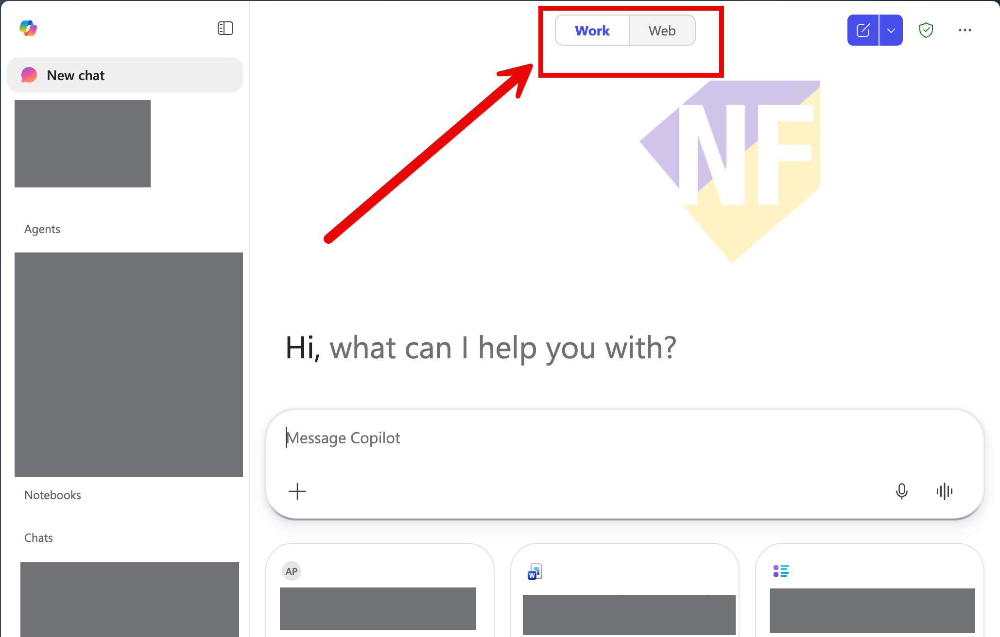
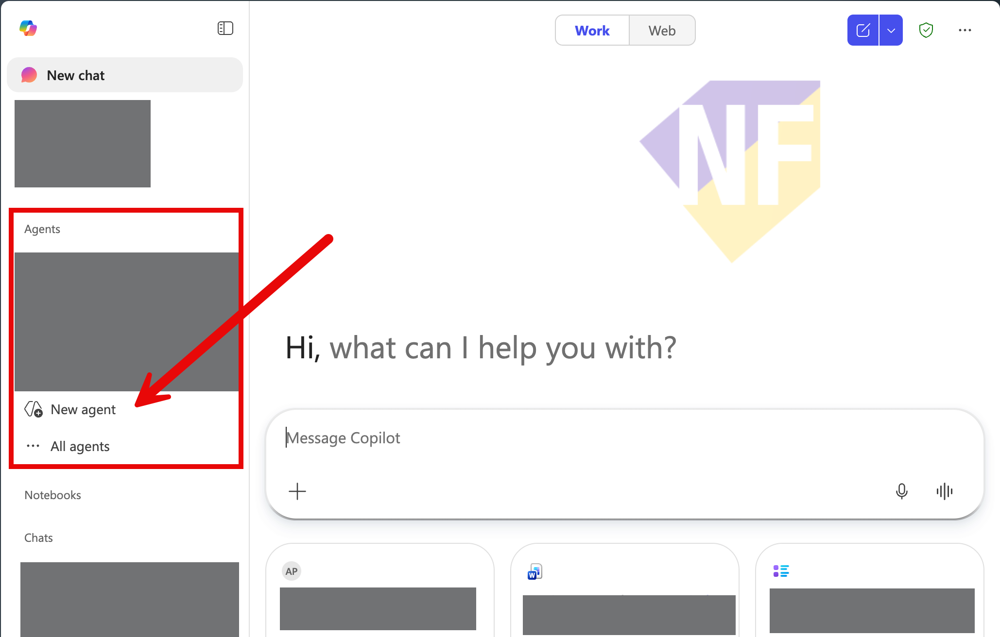
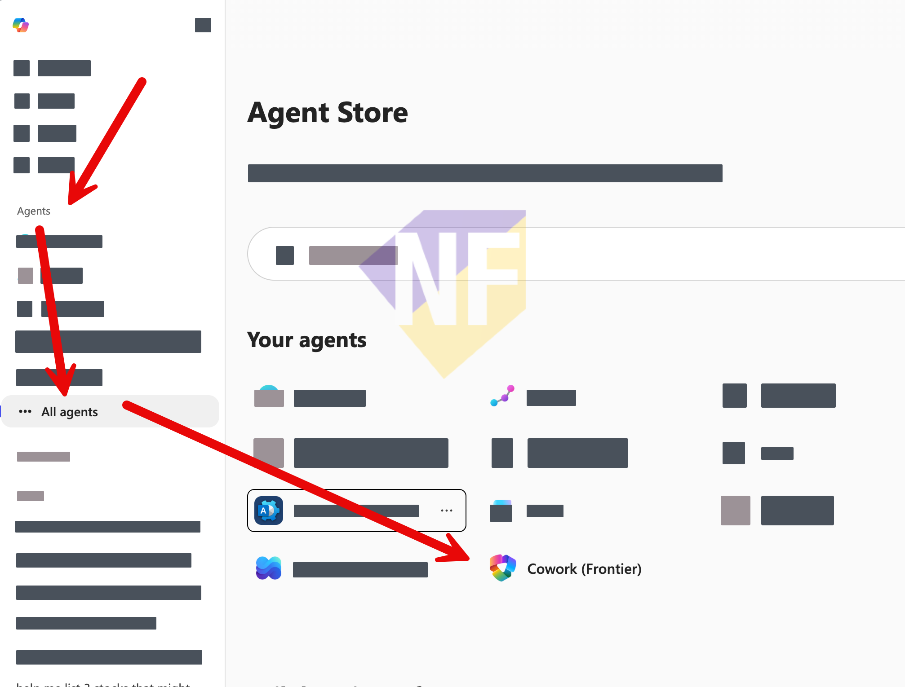
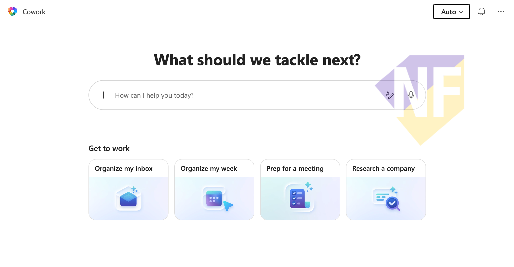

# Session 2 Setup: Copilot Cowork - Checklist (Business User)

Use this checklist before event day.

## Session Outcome

Participants will use Copilot Cowork to complete business tasks across Microsoft 365 with action approvals, while staying in control.

## What To Prepare (Send to Audience)

### 1. Licensing and Access

- [ ] Microsoft 365 Copilot license is active.
- [ ] Tenant is enrolled in Frontier preview for Cowork.
- [ ] Account can access https://m365.cloud.microsoft.

### 2. Environment Readiness

- [ ] Can sign in with organization Microsoft account.
- [ ] Copilot Chat opens successfully.
- [ ] Work mode is available (if licensed plan is applied).

### 3. Cowork Visibility Check

- [ ] User can access 'All agents' section from the left navigation of Copilot chat.
  
- [ ] Cowork is visible in left navigation or via Agent Store (All agents).
  
- [ ] User can see and interact with a Cowork chat.
  

## Useful References

- Cowork overview: https://learn.microsoft.com/microsoft-365/copilot/cowork/
- Get started with Cowork: https://learn.microsoft.com/microsoft-365/copilot/cowork/get-started
- Use Cowork controls and approvals: https://learn.microsoft.com/microsoft-365/copilot/cowork/use-cowork
