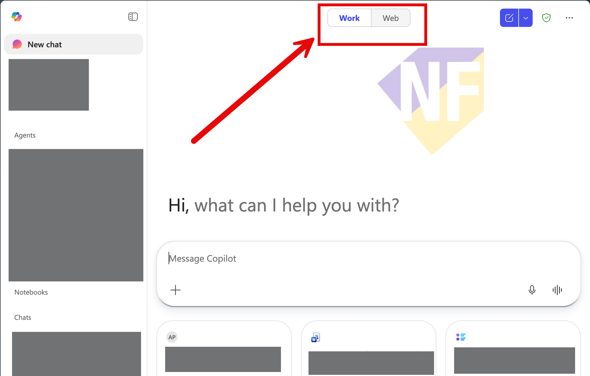
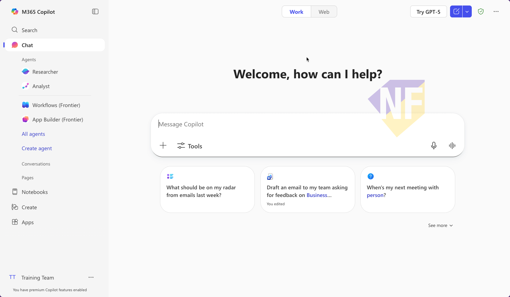
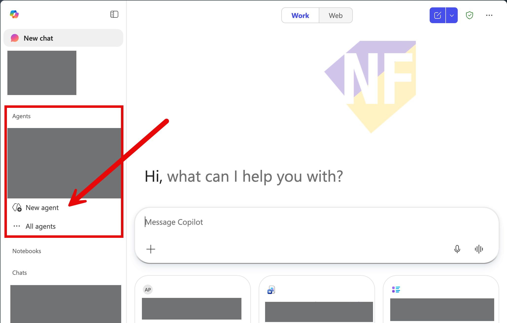
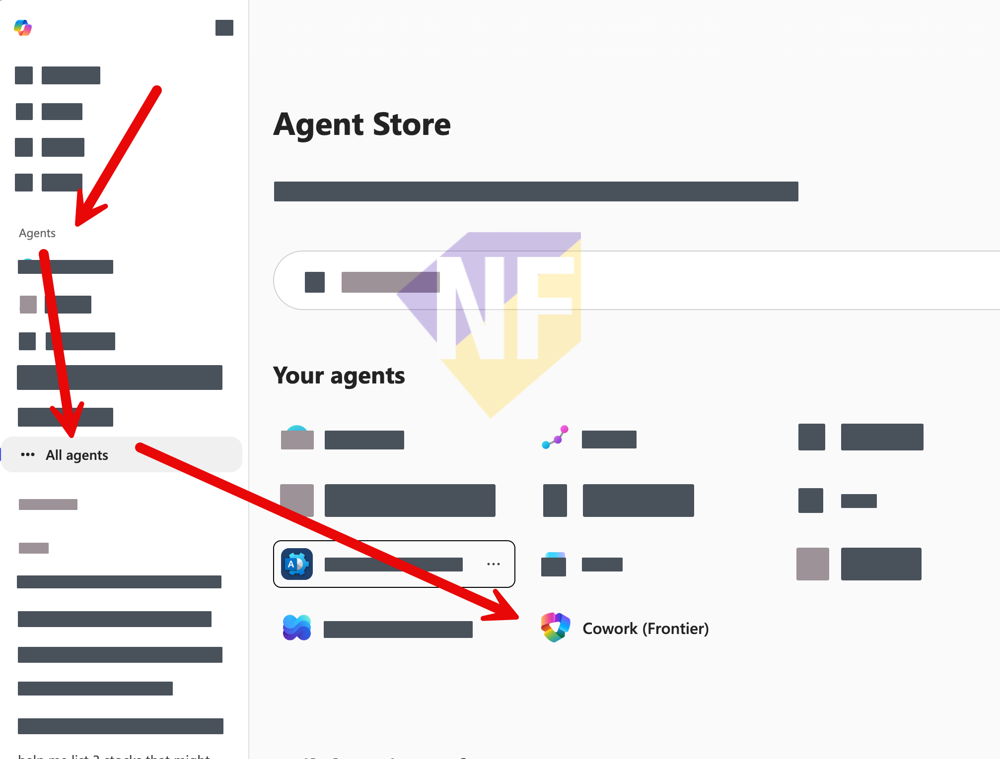

# Exercise 01: เข้าสู่ระบบและเพิ่ม Cowork ลงใน Agent List

🔑 ต้องการ M365 Copilot License
🔑 ต้องเปิดใช้งาน Cowork (Frontier preview)

ในแบบฝึกหัดแรกนี้ เราจะ Sign in ด้วยบัญชีที่ Event จัดเตรียมไว้, ตรวจสอบว่า M365 Copilot Plan พร้อมใช้งาน แล้วเพิ่ม **Cowork (Frontier)** เข้า Agent List เพื่อใช้ในแบบฝึกหัดถัดไป

---

## ไฟล์ที่ต้องดาวน์โหลดก่อนเริ่ม

กดลิงก์ด้านล่างเพื่อดาวน์โหลดไฟล์ตัวอย่างสำหรับ Session นี้ลงในเครื่อง:

- 📄 [meeting-notes.docx — บันทึกการประชุม Q2 Planning](https://github.com/teerasej/multi-agent-try-out/raw/main/session-2-copilot-cowork/files/meeting-notes.docx)
- 📊 [project-tasks.xlsx — Task Tracker โปรเจกต์ Website Redesign](https://github.com/teerasej/multi-agent-try-out/raw/main/session-2-copilot-cowork/files/project-tasks.xlsx)
- 📑 [project-overview.pptx — Project Overview Presentation](https://github.com/teerasej/multi-agent-try-out/raw/main/session-2-copilot-cowork/files/project-overview.pptx)

> **💡 เคล็ดลับ:** เก็บไฟล์เหล่านี้ไว้ในโฟลเดอร์ที่หาง่าย เช่น Desktop หรือ Downloads เพราะต้องใช้ในแบบฝึกหัด 04 และ 05

---

## Feature 1: Sign In และตรวจสอบ Plan

1. เปิดเบราว์เซอร์ แล้วไปที่ **[https://m365.cloud.microsoft](https://m365.cloud.microsoft)**

2. กด **Sign in** แล้วใช้บัญชีที่ Event จัดเตรียมให้ (รับจาก Facilitator)

3. เมื่อเข้ามาในหน้าหลักแล้ว สังเกตปุ่ม **Work** / **Web** ที่ด้านบนของหน้าจอ — ตรวจสอบว่า Tab **Work** ใช้งานได้

   

4. สังเกตที่มุม **ซ้ายล่าง** ของหน้าจอ — ควรแสดงข้อความ **"You have premium Copilot features enabled"** หรือชื่อ Plan ที่บ่งบอกว่า M365 Copilot พร้อมใช้งาน

   

> **⚠️ หมายเหตุ:** ถ้าไม่เห็นข้อความดังกล่าว ให้แจ้ง Facilitator เพื่อตรวจสอบ License ของบัญชีที่ได้รับ

---

## Feature 2: เปิด Agent Store และเพิ่ม Cowork

1. จากหน้าหลัก กดที่ **Agents** ในเมนูด้านซ้าย แล้วเลือก **All agents**

   

2. หน้า **Agent Store** จะเปิดขึ้น — ในส่วน "Your agents" ให้มองหา **Cowork (Frontier)**

   

3. กดที่ **Cowork (Frontier)** แล้วกด **Add** หรือ **Open** เพื่อเพิ่ม Cowork เข้า Agent List ของคุณ

4. กลับสู่หน้า Chat — คุณควรจะเห็น **Cowork** ปรากฏในส่วน Agents ด้านซ้ายแล้ว

---

## สรุป

คุณได้ Sign in เรียบร้อยและเพิ่ม Cowork เข้า Agent List สำเร็จแล้ว ตอนนี้พร้อมสำหรับแบบฝึกหัดถัดไปที่จะใช้ Cowork ทำงานจริง ๆ
