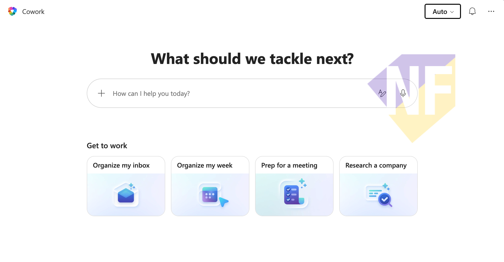

# Exercise 02: สร้างเอกสาร Word ด้วย Cowork

🔑 ต้องการ M365 Copilot License
🔑 ต้องเปิดใช้งาน Cowork (Frontier preview)

แบบฝึกหัดแรกกับ Cowork! เราจะให้ Cowork สร้าง **เอกสาร Word สำหรับ Meeting Agenda** จากการบรรยายด้วยภาษาธรรมดา และสังเกตว่า Cowork แสดงขั้นตอนการทำงานและขอ Approval ก่อนดำเนินการ

---

## Feature 1: เปิด Cowork

1. จากหน้า M365 Copilot Chat ให้กดที่ **Cowork** ในส่วน Agents ด้านซ้าย

   

2. หน้า Cowork จะเปิดขึ้น — สังเกตว่าต่างจาก Copilot Chat ตรงที่หน้าจอแสดงข้อความต้อนรับว่า **"What should we tackle next?"**

---

## Feature 2: สร้าง Meeting Agenda Word Document

1. ในช่อง "How can I help you today?" พิมพ์หรือวาง Prompt ด้านล่าง แล้วกด Enter:

   ```
   สร้างไฟล์ Word สำหรับ Meeting Agenda ของการประชุมทีม Q3 Planning ที่จะมีขึ้นในวันศุกร์นี้ โดยมีวาระ 3 หัวข้อ: 1) ทบทวนผลงาน Q2 2) เป้าหมาย Q3 3) แบ่งงานทีม
   ```

2. สังเกตการทำงานของ Cowork:
   - Cowork จะแสดงแผนการทำงานในขั้นตอนย่อย ๆ
   - มีการแสดงว่ากำลังใช้ Skill **Word**
   - อาจมีปุ่ม **Approve** หรือ **Confirm** ให้กดก่อนดำเนินการ — ให้กด **Approve** เพื่อยืนยัน

3. รอ Cowork สร้างเอกสาร — เมื่อเสร็จจะมีลิงก์หรือ Preview ของไฟล์ Word ปรากฏขึ้น

4. กดที่ลิงก์เพื่อเปิดเอกสาร Word และตรวจสอบเนื้อหา

> **💡 เคล็ดลับ:** ลองสังเกตที่ Panel ด้านขวา — Cowork จะแสดง Skills ที่กำลัง Active เช่น "Word" จะไฮไลต์ขึ้นมาระหว่างสร้างเอกสาร

---

## สรุป

คุณได้ทดลองให้ Cowork สร้างเอกสาร Word จากคำบรรยายภาษาธรรมดาสำเร็จแล้ว Cowork ทำให้เห็นว่าการสร้างเอกสารไม่จำเป็นต้องเปิด Word แล้วพิมพ์เองอีกต่อไป ในแบบฝึกหัดถัดไป เราจะลองสร้าง Excel Task Tracker กัน

---

แบบฝึกหัดถัดไป: [Exercise 03: สร้าง Task Tracker ด้วย Cowork](../03-create-spreadsheet/README.md)
